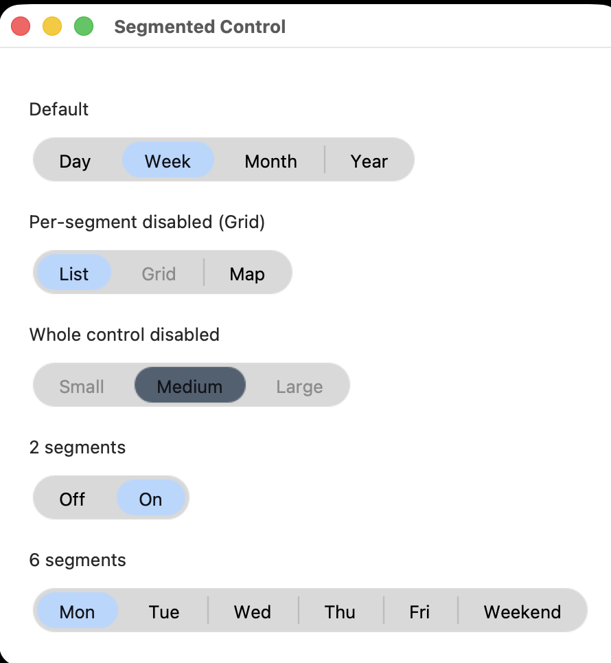

# tryst-segmented

An iOS/web-style segmented control for [tryst](../), Crystal's Tcl/Tk
binding — a rounded pill of mutually exclusive text options with a
sliding highlight, in place of a row of ttk radio buttons. Built on
`Tryst::OwnerDrawnWidget` and rendered through
[tryst-vector](../tryst-vector/).

```crystal
require "tryst"
require "tryst-segmented"

app = Tryst::App.new
control = Tryst::SegmentedControl.new(app, options: ["Day", "Week", "Month", "Year"], selected: "Week")
control.pack(padx: 16, pady: 8)

control.on_action { |value| puts "now on #{value}" }

app.show
app.mainloop
```



## API

**Constructor**

- `options` — the segment labels, left to right. Must be non-empty and
  contain no duplicates.
- `selected` — starts on `options.first` if not given; must be one of
  `options`.
- `accent` — a `#rrggbb` hex string to override the theme's own accent
  color.
- `disabled_dim` — how much the accent/text dim when the whole control
  is disabled (`0.0`–`1.0`, default `0.45`).
- `height` — the pill's height in logical pixels. Segment width comes
  from each label's own text, not from `height` — segments are never
  forced to equal width.

**Instance methods**

- `#selected` / `#selected=` — read or set the current selection.
  `#selected=` never fires `#on_action`.
- `#on_action { |value| ... }` — fires on every user-driven change
  (click, Left/Right), never for a programmatic `#selected=`.
- `#disable_segment(option)` / `#enable_segment(option)` /
  `#segment_disabled?(option)` — disable one segment without affecting
  the rest of the control. Independent of `#disabled=` (inherited,
  disables the whole control).

**Interaction**: click a segment, or Tab into the control and use
Left/Right (clamped at either end, skipping any disabled segments).

There's no `ui.segmented`/DSL `bind:` — like `Switch` and
`ValueSlider`, this lives at the App layer, not as a registered
`WidgetType` (see [CUSTOM_WIDGETS.md](../CUSTOM_WIDGETS.md)). Wire a
`Tryst::UI::Var` manually:

```crystal
control.on_action { |v| var.value = v }
var.on_change { |v| control.selected = v }
```

## Requirements

Whatever tryst and tryst-vector need — Crystal >= 1.21.0, Tcl/Tk 8.6,
and ThorVG >= 1.0 (see [tryst-vector's own README](../tryst-vector/)).

## Examples

Run this **from this directory**, not the repo root — `require
"tryst"` resolves against the `lib/` of wherever crystal runs.

```
cd tryst-segmented
crystal run examples/segmented_control_demo.cr
```

## Tests

```
shards install
crystal spec                    # host
scripts/docker-test.sh          # Debian forky, same suite
```

`scripts/docker-test.sh` builds from the repo root, since the `path:
../` dependencies on tryst and tryst-vector have to be inside the
build context; it takes the same arguments `crystal spec` does, so a
focused run works there too.
